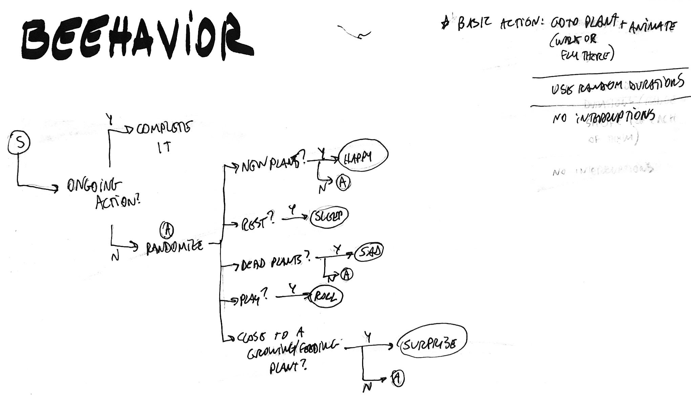

# Project Logs

## 2018-03-26

### Enric & Rebecca

We went to the woodshop for consultation and made some decision wrt the joining of the frame and shelves (we will use l-brackets) and using a round top board to attach the monitor with VESA screws (M4 threads, 7.4mm depth in the monitor).

About the stuffing cover: we thought of pool needles attached to the edge of the board, to protect from it and also to help shape it. The cover from the board edge to the screen hole would be held together by draw strings and fabric, according to the diagram below. This would make it easier to open and close and it would give a good hold to the fabric.

We also discussed about patterning the wall fabric of the well with a quilted brick pattern, similar to this one [on this link](https://www.youtube.com/embed/iECXconznF8?list=PLNkZhEjxH0nIsR4-uV6H-pQbMziUejO__), but in larger size for each brick.

We also managed to take apart the monitor stand, so now it can more easily stand flat on surface.

## 2018-03-23

### Enric & Rebecca

We worked some time today on discussing the build of the controller and its supporting structure. Here are some loose notes from today's working session.

#### The cover / stuffing

We are thinking about making a large fabric cover with a hole in the center for the screen with a duvet-like stuffing near that hole (forming the well border).

The volume between the monitor, the support board would be filled with foam or other soft materials.

The cover can be embroidered with different materials and patterns to create a more patchwork kind of aesthetic that would hopefully invite players to touch and interact with the controller.

####  Roots

Make them so they are long and can reach any spot on the bottom shelf and also in a way that we can stuff it

Discussed ways to connect them to the electronics shelf. The idea is to use staples for holding the fabric and take most of the mechanical stress of players tugging the roots. The conductive thread would be connected via a terminal block as intermediary, with hot glue to help hold it in place.

We are experimenting with different ways of sewing the roots in order to keep the conductive thread protected from tugging and also create a good compartment to put stuffing.

We are scheduling a learning session with Marc about the sewing machine on the Maker Lab.

#### Structure

We'll visit the woodshop for the open consultation period Monday morning, to see what can we do and how. Also, we'll try to make an appointment for a working session soon if that's possible.

## 2018-03-22

### Enric

Ok, so after the class today, I visited the wood workshop. Got their schedule and also time info to try and book a spot for building the frame and structure for the controller.

I did some sketches in paper and on 3D modelling. Here is how the current version looks like:

The top shelf is 100mm away from the board that supports the screen. The top shelf will hold the laptop and the electronic board (a MakeyMakey), and roots will be fixed here. The bottom shelf will have adjustable height, to accommodate different player needs and settings, and it has the purpose of being the "ground" where the roots are connected. The whole controller structure will be covered with fabric, with cuts so that players can reach through to the roots. I think this is looking interesting.

## 2018-03-21

### Enric

Another interesting reference: the [#carewave manifesto](http://carewave.games/manifesto/). The definition of care they put forward is very relevant to what I think of our game's goals:

> Care is a consensual exchange that brings all parties towards mindfulness, empathy, and understanding; inspiration and action; strength and connection; purpose and insight; safety, rejuvenation and healing; and joy, peace, and agency. (3-A)

The whole document is very good and I believe our game dialogues with that very much.

Another reference that sprung up is [this text by ElectronDance on Japanese "secret boxes"](http://www.electrondance.com/screw-your-walking-simulators/) and their relationship to trial-and-error. This is an important element to be thought of in or game: I don't think we rely too much on this dynamic, but maybe we should? I really like the unveiling of secrets as an experience. Here is the author's definition of the term:

> A secret box is a game which is built around some form of content and challenge is trivial or absent. The emphasis is on conveying moments or ideas to the player rather than testing the player's abilities.

In other news, we got a screen (here are its [specs](https://www.cnet.com/products/lg-l1718s-lcd-monitor-17/specs/))! I found its [disassembly manual](https://www.manualslib.com/manual/701608/Lg-Flatron-L1718s.html?page=8), so we can dismount it and make it smaller for our building purposes. It has 17" and a 1280x1024 resolution, so we can optimize the digital game for that. In terms of size, it's a bit small, so it might be a good idea to make the whole game more of a tabletop object.

## 2018-03-20

### Enric

While talking with Rebecca about references, I went looking for more games on Shake That Button](http://shakethatbutton.com/) for some alternative controllers that were related with our project. I found a few and I think it's good to list them here.

- [Shoal](http://shakethatbutton.com/shoal/): similar in mechanics, visual solutions and goals, but ours has a stronger emphasis on materials and touch.
- [Ferdinand Laboite](http://shakethatbutton.com/ferdinand-laboite/): uses the "hidden in a box" idea and has a similar emphasis on materiality as our project, but it's focused on providing a clumsy and hectic game experience.
- [Proteus](https://en.wikipedia.org/wiki/Proteus_(video_game)): it's a game with a traditional controller, but the art style and atmosphere are very inspiring for us.
- [Viridi](http://store.steampowered.com/app/375950/Viridi/): similar idea of garden and care and open-ended gameplay. Does not uses altctrls.
- [We are fine](http://wearefine.ca/): the game has a key emphasis on touch and listening. Our game would like to provide a reflective mood too, but without verbal stories.

Another thing! I was talking with TOny about Shoal, the game he made for CriticalHit15. While discussing it, we thought of how a cilindrical frame could work for our game. Based on that I thought of barrels and wood spools as possibilities for the game structure. Here is a reference image. There are used plastic drums for 20$, but also we could try to find some for recycling. Another option would be to build something similar from scratch.

## 2018-03-14

### Enric

Today we are doing some co-working to improve the visual feedback of the different gameplay elements, as well as defining how biomes will work in game. I structured them to make them work with the Pool system for prefabs and to make it as easy as possible to shift between the biomes gradually. It works kinda well for now, but we still need to add some more interactivity and the depletion and humidity factors in the whole interaction. We also added clouds that can be controlled with a single float, which will help a lot when making them interact with players.

## 2018-03-12

### Enric

Today I'll work on making a basic bee AI. With this addition, we might have the basic loop and most of the in-game elements ready for Thursday's presentation. I think that besides including the bee and well dynamic, I should put some work on the feedback on growth and nutrition actions.

#### Bee AI

I'm thinking that a basic behaviour could be expressed as a flowchart. This is a simple version that emphasizes randomization.

When implementing it, I improved it to allow for 1) picking just plants on the same garden for logic and 2) avoid repeated behavior (never repeats the same action twice). It works quite well as a flow right now. It can be improved with some priorization (an idea: SAD -> HAPPY -> SURPRISED -> REST -> PLAY). This would entail some changes on how data and config is done for each action. Not a big issue, actually.

#### Well dynamics

Ok, got the static garden we had created earlier to work well with the "well" movement of layers. For that I changed that system to work with a perspective camera instead of a scaling dynamic, but I kept the AnimationCurve for tweaking. It worked quite well, and I also used the time to add a fog system that is customized via a gradient. You can see it working on the gif below. The visuals are ok. In terms of functionality, I still need to reset the last layer, so that recycle properly.

## 2018-03-10

### Rebecca
Tonight I pushed what should be the last of our basic animations up. The roots draining has been giving me a hard time, and I'm not 100% satisfied so maybe that will need revision... Enric had had an interesting comment about it yesterday though, saying that it looked more "animal" than plant - I think it's interesting to think about how the roots, the unseen, is maybe the scariest/strangest part of the experience...

## 2018-03-05 to 07

### Enric

Today I'll do some work on putting the plants art into the game. After doing that, we'll be able to prepare the game logic to follow the growth / wilt cycle.

After a lot of struggling with Unity's animation system, I managed to get a continuous transition between growing an wilting that is already integrated with the gameplay variables. From there, it was quite quick to get some other features working: plant reproduction and the wind animation via shaders.

Now I'm focusing on getting the bee animations that Rebecca made and create a basic non-player character (NPC) that uses them. The biggest challenge in this is getting the circular movement working. I'll try out some math-based one, but if it doesn't work I'll work with splines and animation.

## 2018-03-01

### Rebecca

Today we spent most of our time getting re-situated after the break and planning our steps for the first rough prototype showing. Most of this also involved fighting with Anima2D, which has proved to be a one step forward two step back type thing. It’s use of bones can make some really nice deformations but it has proven to be incompatible with the animation switching system we’ve made. So rather than rely on it, Enric is going to dig up some older shaders that will “ripple” the edges of the sprites to make them seem like they are moving.

On my end of things, I’m going to be focusing on getting our bee character animated, which I think (like the other animations so far) will involve a lot of trial and error. Given how low fi everything is, I’m curious how conveying emotion will happen with the bee’s expressions. I think looking at other kids media with similar styles could help.

When I’d first imagined the character I’d been taken with the idea of an ant because I thought the limbs could be useful to convey postures/expressions, but a bee turned out to help convey the notion of a “caretaker” better. So, for now at least, I feel I’m going to rely more on exaggerated flying…

As well, I’ve discussed with Jonathan writing a case study for this project, and so logs will continue to be more detailed from now on :).

## 2018-02-12
### Rebecca
<i> This log is a re-upload of documentation that was kept on Google Drives [here](https://docs.google.com/document/d/1fmgZvUh9lEE4N5qXoiClz1crrsiF6RUvmEVXA8-KvhQ/edit?usp=sharing), which I am doing for the sake of keeping things together </i>.

Personal thoughts:
Given an emphasis on the course being a building block in my thesis program, the two most critical elements of this project for me are that we are able to convey “wellness” (through building a sense of community or connection) and “participatory interactions” clearly. I think we have the second element down quite clearly, or at least we will be able to articulate it more easily because people can touch the thing, but linking the garden back to wellness remains a bit elusive.

Project thoughts:
I tried to sketch out the two project directions we seemed to be generally talking about below. I think it would make sense if we went with the scenario where the game was in a physical community location, that it would presumably be played over a longer period of time and have a heavy DIY or modification capability to it so that it doesn’t get dull like some people suggested it could in class. Here, wellness would be evident in the literal community building side of things.

If we went with something that was a bit more installation-y, I think we could still play with time, but maybe use the short nature of an art exhibit to our advantage. The game could still have no end state, but require two (or more?) people to play it for anything to grow properly. In the sketch for this version I even thought it would be cool if we could somehow make holding hands a killswitch of sorts, where you need to have one hand (garden glove?) connected to the other player to start the game, using your free hand to navigate the space.

Let me know if you need help with the chicken scratch ;)

### Enric

Personal thoughts:
I was thinking a lot about the wellness question too and how it relates to the project as a whole. I realized I have been imagining this game-object-toy as a pivot, an instigator of rituals somehow. Maybe like a playful shrine for self-care. It is part messy, part mysterious, part organic in its fiction. I don’t feel like it needs to be super serious or grave for it, I’d prefer if it had a softer feel overall.

The magic garden-forest mix is for me a good metaphor for dialectical relationships that I see as key for wellness: seen-unseen, conscious-subconscious, agency-structure, short-long term, individual-collective, order-disorder. I think gardens and forests have this tension in them: “What makes a garden beautiful? What about a forest? What makes a plant a weed?”

The garden-forest in a well idea to me is powerful because it draws on fairytale symbolism, which is a great repertoire for invitations and hooks. The idea of invitations (to enter the game-toy fiction) and hooks (to switch to and question reality) is something that is important regardless if we’ll be focusing on children or adults. I think this tensionline is one that we can use to consider each design decision we take. These garden-forest-well symbols can spark discussion by making issues concrete, and by proposing a road for interpretation, a metaphor for processes of self-knowledge.

This is related to how I imagine the players relationship with the caretaker. It would be a limited narrator, one that creates a flimsy conducting thread for the experience. Thinking about the symbolism of the game and its theme, I think it can act as a contradictory narrator: it’s simultaneously a projected self for players but also of an “other” when played collectively. In this way, the narrative perspective it can bring would be enriched by this distancing. Also, I believe this relationship between individual and collective is a very strong relationship to tap into, as it connects directly to how we relate with the tensions in social groups of which we are part, like family, school, and so on.

Another aspect that I think is central is to communicate how time and durations (in general) are fundamental to wellness. Different issues take different times to diff folks in diff contexts with diff levels of engagement, and so on. This can be a great source to think about coping, solidarity, individual and collective. It can also spark conversations about intergenerational wellness and care as this complex, messy, scary, exciting and expressive process. If the process of playing and making sense of the game in the long term helps players to build on these concepts, awesome.

Related to the matter of the temporal dimension of wellness, I am thinking that a good strategy would be to aim for cycles of short term surprises, mid term perceptions of change, and long term consequences. The long term would then drift between recognizing, reflecting, and expressing through these consequences, as players create different goals each time the long term cycles complete.

This is what I have in mind for the “portable roots” way of carrying the game controller, hehe. (http://www.instructables.com/id/Paintbrush-Roll-up-Travel-Kit/)
